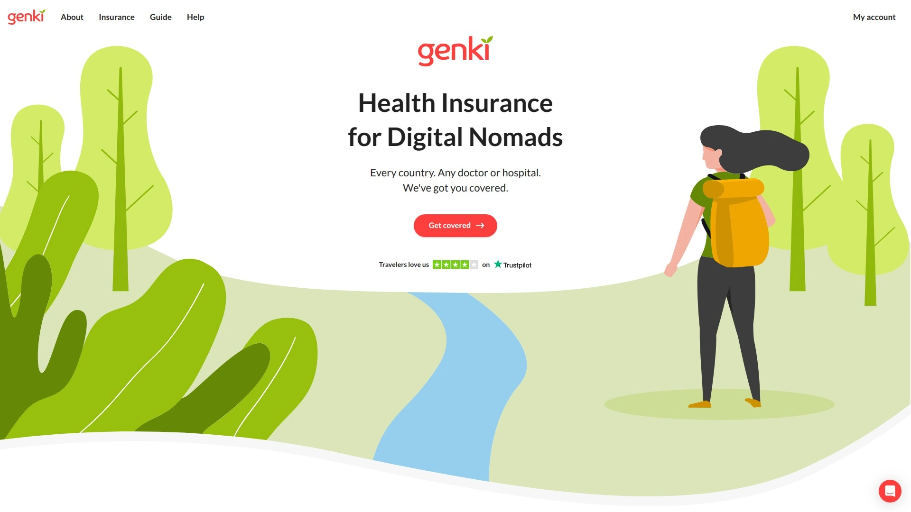
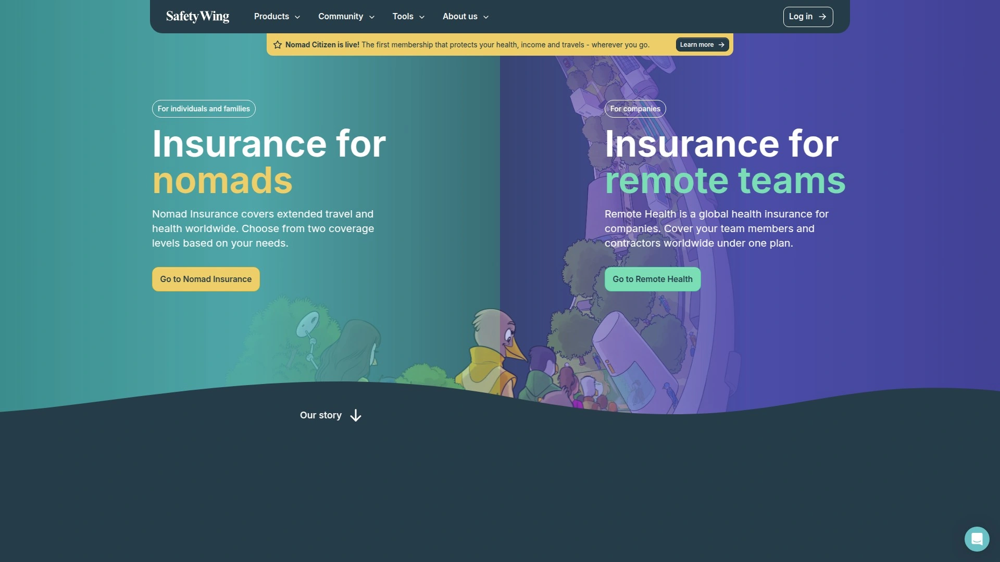
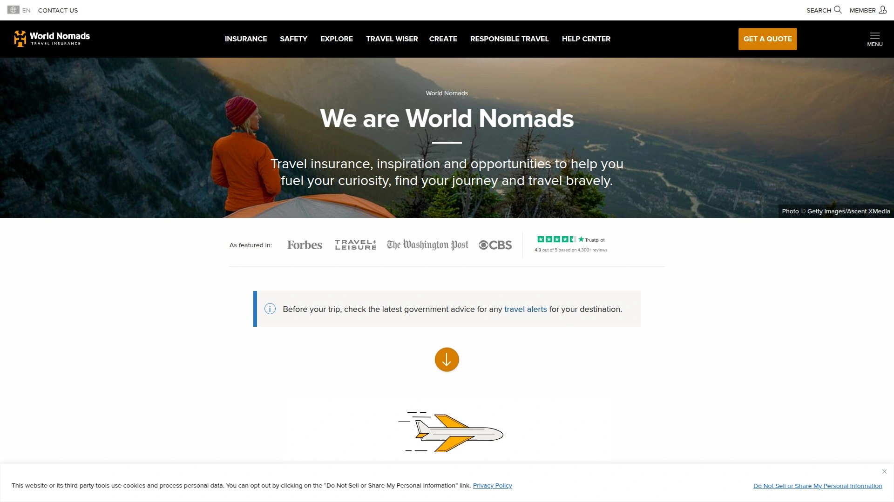
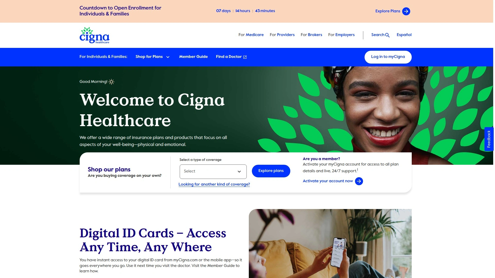
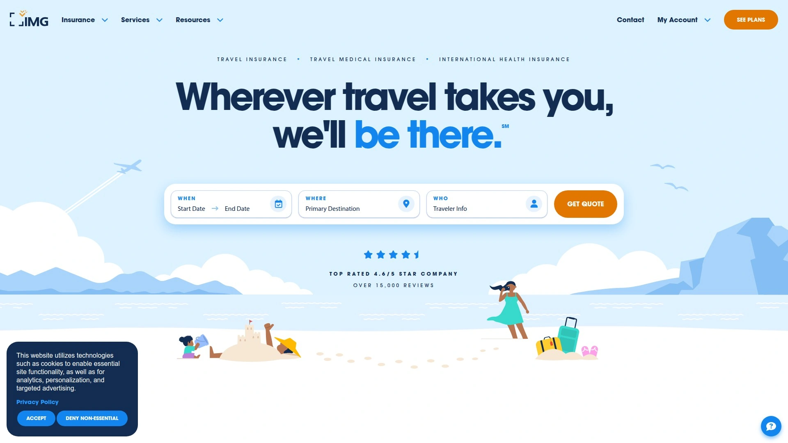

# Top 7 Digital Nomad Health Insurance Ranked in 2025 (Latest Update)

Visiting doctors abroad means navigating unfamiliar healthcare systems, paying thousands upfront for treatments your domestic insurance refuses to cover internationally, then fighting for months to get partial reimbursements—if any arrive at all. Traditional health insurance collapses the moment you cross borders, leaving digital nomads and long-term travelers financially exposed to medical emergencies, routine care costs, and evacuation scenarios that bankrupt families.

The best digital nomad health insurance combines worldwide coverage across 180+ countries, flexible subscription models you can pause between trips, and simple claims processes delivering reimbursements within 10-14 days without requiring you to return home for treatment approval.

***

## **[Genki](https://genki.world)**

Flexible subscription-based coverage including 180 days home country protection annually.

Genki stands out by offering genuine home country coverage up to 180 days per year—a rare feature letting digital nomads visit family, handle business matters, or simply take breaks from constant travel without losing healthcare access. This flexibility proves invaluable for nomads maintaining connections to home countries while exploring the world, eliminating the anxiety of returning home uninsured during emergencies or planned visits.

The subscription-based model delivers month-to-month flexibility without forcing annual commitments typical of traditional international insurance. Start coverage when departing, pause during extended home stays exceeding the 180-day allowance, restart when traveling resumes—this adaptability matches the unpredictable lifestyle digital nomads actually live rather than forcing them into rigid structures designed for corporate expats on predetermined assignments.

**Comprehensive medical coverage addresses real nomad healthcare needs.** Plans cover emergency care, ambulance services, dental care and cleaning, vaccines, and maternal care—the full spectrum of health needs arising during extended international living. Mental health support acknowledges the psychological challenges of constant movement, cultural adjustment, and geographic isolation from support networks. This holistic approach treats nomads as complete humans rather than just bodies requiring occasional emergency intervention.

Pricing starts affordably at €48.30 monthly with multiple tiers accommodating different coverage levels and budgets. The €180 per month upper-tier plan delivers extensive coverage rivaling premium expat policies while maintaining flexibility those rigid products lack. Price guarantees extending up to two years help budget-conscious travelers project healthcare costs accurately rather than facing unpredictable premium increases mid-journey.

The 24/7 multilingual support ensures assistance regardless of timezone or language barriers—crucial when medical emergencies strike in countries where you don't speak local languages. Treatment happens at any licensed healthcare provider worldwide, avoiding restrictive networks limiting options. The simple reimbursement system or direct billing option speeds payment processing, getting you treated quickly whether paying upfront or having providers bill Genki directly.

Users consistently praise Genki's straightforward claims process, responsive customer service, and transparent pricing structure. The company understands digital nomad lifestyles deeply, designing products addressing actual pain points rather than adapting traditional expat insurance inadequately serving this growing demographic. For nomads wanting comprehensive coverage with maximum flexibility at reasonable prices, Genki delivers the balance other providers sacrifice when optimizing for one attribute.

***

## **[SafetyWing](https://safetywing.com)**

Start, pause, and cancel anytime with 10-day reimbursement and 180-country coverage.

SafetyWing pioneered digital nomad insurance when launching in 2018, creating a category barely existing previously. The company's Nomad Insurance product specifically targets remote workers and travelers living location-independent lifestyles, offering flexibility matching their unpredictable movements. Coverage spans over 180 countries globally, ensuring protection regardless of wandering patterns or sudden destination changes.

The hallmark feature enabling ultimate flexibility—start, pause, and cancel coverage anytime without penalties or commitments. This addresses the core nomad pain point: traditional insurance demands annual contracts despite uncertain travel plans. SafetyWing recognizes nomads don't know where they'll be in six months, letting them adjust coverage matching actual circumstances rather than forcing expensive commitments for theoretical scenarios.

**Medical coverage includes emergencies, hospital stays, doctor visits, prescription medications, and emergency evacuation.** The $56.28 monthly starting price positions SafetyWing among the most affordable comprehensive options, making international health insurance accessible even for budget-conscious travelers. Reimbursement arrives as quickly as 10 days after claim submission—dramatically faster than traditional insurers taking 4-8 weeks processing international claims.

No health pre-checks required before activation removes barriers preventing people with minor conditions from obtaining coverage. This accessibility philosophy extends SafetyWing protection to individuals traditional insurers reject, though pre-existing conditions and cancer treatments remain excluded—standard limitations across digital nomad insurance reflecting genuine actuarial constraints rather than arbitrary discrimination.

Remote Health represents SafetyWing's evolution into full international health insurance for digital nomads committing to permanent location independence. This upgraded option delivers comprehensive coverage replacing domestic insurance entirely rather than supplementing it. Companies can cover entire distributed teams under unified policies, simplifying benefits administration for remote-first organizations previously struggling with internationally scattered employees.

The company's mission transcends profit maximization—SafetyWing aims to build global social safety nets matching modern work reality rather than clinging to geographic-based systems failing mobile populations. This philosophical foundation drives product innovation genuinely serving nomad needs rather than repackaging traditional insurance inadequately.

***

## **[World Nomads](https://www.worldnomads.com)**

Adventure sports coverage including 200+ activities with emergency medical up to $100,000.

World Nomads built its reputation covering adventure sports automatically included in standard plans—over 200 activities from scuba diving and mountain biking to bungee jumping and free diving up to 197 feet depending on plan selection. This differentiator attracts active travelers combining remote work with outdoor pursuits, eliminating the expensive adventure sports waivers other insurers demand.

Two plan tiers accommodate different needs and budgets. The Standard Plan delivers essential coverage for typical travel scenarios at lower premiums. The Explorer Plan increases policy limits, expands covered benefits, adds more extreme sports, and raises reimbursement caps for trip cancellation, interruption, delays, baggage issues, and medical emergencies. This tiered approach lets travelers match coverage to actual risk profiles rather than overpaying for unused protection.

**Comprehensive trip protection extends beyond pure health coverage.** Plans include trip cancellation and interruption reimbursement, baggage and gear protection (crucial for digital nomads carrying expensive laptops), travel delay coverage, terrorism protection, and even death overseas benefits. This holistic approach acknowledges travelers face non-medical risks requiring financial protection, creating comprehensive safety nets rather than narrow health-only policies.

Emergency medical expenses and medical evacuation receive generous policy limits ensuring adequate protection when catastrophic situations arise. The 24/7 travel assistance hotline provides support regardless of timezone or location, connecting travelers with resources, translators, and emergency coordinators. Age-agnostic pricing avoids premium increases common with competitors charging older travelers exponentially more—World Nomads charges everyone equally based on trip parameters rather than age discrimination.

The downsides deserve acknowledgment. World Nomads costs more than budget competitors—$127.64 monthly for basic coverage exceeds SafetyWing and Genki pricing significantly. Plans work secondary to existing insurance, meaning you must file with primary insurers first before World Nomads covers remaining amounts. Pre-existing conditions receive no coverage, and purchasers must be under age 70—standard limitations but worth noting for older nomads or those with chronic conditions.

***

## **[Cigna Global](https://www.cigna.com)**

Premium international insurance with 1.65 million provider network across 200 countries.

Cigna Global represents the premium tier of international health insurance, partnering with 1.65 million doctors and hospitals across 200 countries—the most extensive provider network available. This massive reach ensures access to high-quality healthcare anywhere on earth, from major metropolitan centers to remote locations where medical resources concentrate sparsely. For nomads prioritizing healthcare quality and access over cost minimization, Cigna delivers unmatched global medical infrastructure.

Founded in 1982, Cigna pioneered expatriate health insurance when the category barely existed. Decades of experience show in product sophistication, claim handling efficiency, and global operational capabilities younger companies can't match. The A rating from A.M. Best confirms strong financial stability—critical when trusting an insurer to pay potentially catastrophic medical bills during international emergencies.

**Customizable modular coverage lets you build precisely tailored plans.** Add only benefits you need without paying for unused extras—dental, vision, maternity, mental health, wellness programs, and evacuation modules snap onto base coverage like building blocks. Multiple deductible and cost-sharing options tune premium costs matching budget constraints, creating affordable pathways into premium coverage through strategic benefit selection and higher deductibles.

Plans cover routine check-ups alongside emergencies, hospital stays, outpatient care, emergency evacuation, and mental health services—comprehensive care addressing all health needs rather than emergency-only protection. The secure online portal simplifies administration, letting you upload medical documents, check claim status, and access policy details anywhere with internet. Claims processing moves quickly compared to traditional insurers, getting reimbursements to you faster when cash flow matters.

Premium pricing reflects comprehensive benefits, extensive networks, and established reputation. Expect costs exceeding budget-focused competitors substantially, but receive correspondingly superior coverage, provider access, and claim reliability. Cigna particularly suits established professionals, families with children requiring pediatric care, and anyone with complex health needs demanding top-tier medical access regardless of location.

***

## **[Insured Nomads](https://insurednomads.com)**

Tailored plans for remote workers with mental health, lounge access, and security tracking.

Insured Nomads designs products specifically for modern remote workers rather than backpackers or quick vacationers, acknowledging these populations have fundamentally different insurance needs. You choose emergency-only travel medical for 30-90 day trips or comprehensive long-term global health insurance covering extended nomadic lifestyles. This targeting creates products actually serving remote worker circumstances rather than forcing them into travel insurance designed for two-week holidays.

The differentiation shows in included extras competitors omit. Global employee assistance programs provide mental health support, legal assistance, and crisis counseling—services remote workers need when facing psychological challenges, contract disputes, or emergency situations far from home support systems. Airport lounge access during delays transforms frustrating wait times into productive work sessions or relaxation opportunities. The security tracking app monitors local risks, alerting you to political instability, natural disasters, or safety threats in your current location.

**Mental health coverage receives proper attention** rather than token acknowledgment. Long-term nomadic living creates unique psychological pressures—isolation, cultural adjustment difficulties, relationship strains from geographic separation, and identity questions arising from constant movement. Insured Nomads recognizes these realities, providing substantive mental health benefits alongside physical healthcare rather than treating minds as optional afterthoughts.

The Trustpilot score of 4.2 out of 5 reflects generally positive customer experiences with fast claims processing, transparent communication, and intuitive setup. Users appreciate the customization options, premium benefits, and sophisticated understanding of remote work challenges. However, pricing exceeds budget competitors—you pay for convenience, comprehensive benefits, and remote-worker-specific features rather than bare-bones emergency coverage.

Some users mention dense policy documentation requiring careful reading to understand exactly what's covered versus excluded. The app occasionally bugs according to reviews, though core functionality remains reliable. These minor frustrations shouldn't deter serious consideration—Insured Nomads delivers genuinely differentiated value for remote workers willing to pay for premium experiences rather than accepting generic travel insurance inadequately serving their needs.

***

## **[AXA Global Healthcare](https://www.axaglobalhealthcare.com)**

Expat health insurance with Mind Health service and 48-hour claim settlement.

AXA Global Healthcare leverages parent company AXA's massive global insurance presence—the number two insurance brand worldwide according to Interbrand's 2024 rankings. This institutional backing provides financial security and operational resources smaller insurers can't match. For expats and long-term nomads wanting rock-solid financial guarantees their insurer won't collapse mid-policy, AXA's stability proves reassuring.

The five coverage levels—Foundation through Prestige Plus—accommodate varying needs and budgets. Foundation covers basic needs affordably, Standard adds moderate benefits, Comprehensive delivers substantial protection, while Prestige and Prestige Plus provide all-encompassing coverage rivaling the best international health insurance anywhere. This tiered structure creates entry points at multiple price ranges rather than forcing all-or-nothing choices.

**Mind Health service acknowledges mental health importance** through dedicated support beyond token coverage. Access psychologists for up to six sessions per non-emergency mental health concern annually—substantive assistance for anxiety, depression, adjustment disorders, and relationship issues arising from expat life's unique pressures. This proactive mental health support prevents minor issues from escalating into crises requiring intensive intervention.

Virtual Doctor service provides telemedicine access fitting healthcare into busy schedules without taking time off or sitting in waiting rooms. Book telephone appointments 24/7 throughout the year, receiving callbacks typically within 24 hours. The Second Medical Opinion service connects you with specialists reviewing diagnoses and treatment recommendations, ensuring nothing gets overlooked when facing significant health decisions. These digital health tools augment traditional in-person care, creating hybrid care models matching modern lifestyles.

Over 80% of eligible claims settle within 48 hours when complete information accompanies submissions—exceptional speed compared to traditional insurers taking weeks processing claims. Evacuation and repatriation coverage organizes emergency transport when local treatment proves inadequate, moving you to appropriate facilities and returning you afterward. These emergency services deliver real value during catastrophic scenarios justifying comprehensive insurance despite higher premiums.

***

## **[IMG Global](https://www.imglobal.com)**

Diverse plan portfolio with 60+ options covering missionaries, crew members, and adventure sports.

IMG Global operates since 1990 providing international medical and travel insurance through extensive product catalogs addressing nearly every conceivable travel scenario. The 60+ available plans ensure some option fits your specific circumstances whether you're an expat, missionary, cruise ship crew member, frequent business traveler, adventure sports enthusiast, or traditional tourist. This product diversity eliminates the "close enough" compromises forced by companies offering just one or two standardized plans.

Underwriting through SiriusPoint (A- FSR rating) and Crum & Forster (A rating) from AM Best provides financial security backing claim payments. These solid ratings confirm IMG maintains adequate reserves paying claims even during economic downturns or catastrophic events generating massive simultaneous claims. For travelers trusting insurers with potentially life-altering medical bills, these ratings matter significantly.

Plans oriented toward travel medical coverage cost substantially less than comprehensive trip protection products, creating affordable options for budget-conscious travelers prioritizing health coverage over trip cancellation or baggage protection. The Patriot International Lite and Platinum plans deliver medical coverage from $50,000 to $8 million without trip cancellation or interruption benefits, dramatically reducing premiums for travelers not needing those protections.

**Multi-trip annual plans serve frequent travelers** through Patriot Multi-Trip International (for U.S. citizens) and Patriot Multi-Trip America (for non-U.S. citizens). These annual policies cover unlimited trips throughout the year, eliminating the hassle of purchasing separate policies for each journey. For digital nomads hopping between destinations monthly, annual multi-trip coverage provides administrative simplicity and often costs less than individual trip policies accumulated over 12 months.

However, IMG receives mixed reviews online. Some travelers report excellent experiences with fast claims and helpful support, while others describe frustrating claim denials, poor communication, and difficult reimbursement processes. This inconsistency suggests service quality varies significantly—possibly by plan type, claim complexity, or individual representative handling your case. Research specific plan reviews rather than trusting company-wide ratings when considering IMG products.

***

## FAQ

**Can digital nomad health insurance actually replace my domestic health coverage entirely?**

Comprehensive plans from Genki, SafetyWing's Remote Health, Cigna Global, and AXA Global Healthcare can serve as primary insurance replacing domestic coverage for people committing to permanent nomadic lifestyles. However, most digital nomad insurance excludes or severely limits home country coverage—Genki's 180-day annual home country coverage represents rare exception. If you spend significant time in your passport country annually, maintain domestic insurance alongside nomad coverage or choose plans specifically including extended home country protection. Budget travel medical plans from World Nomads or IMG work secondary to existing insurance, requiring you to maintain primary domestic coverage.

**How quickly do digital nomad insurance providers actually reimburse claims compared to traditional insurers?**

Leading nomad-focused insurers process claims dramatically faster than traditional companies. SafetyWing reimburses within 10 days, Genki aims for two-week turnarounds, and AXA settles over 80% of claims within 48 hours when documentation is complete. Traditional domestic insurers often take 4-8 weeks processing international claims due to unfamiliarity with foreign healthcare systems and additional verification requirements. This speed difference matters significantly when you've paid thousands upfront for emergency treatment and need reimbursement restoring depleted travel funds. Direct billing arrangements where hospitals bill insurers directly eliminate reimbursement delays entirely but aren't universally available.

**What's the real difference between travel insurance and digital nomad health insurance?**

Travel insurance covers trip-specific risks like cancellations, delays, and lost baggage alongside emergency medical care, but it's designed for short trips with defined start and end dates. Digital nomad health insurance provides ongoing medical coverage for extended international living without trip duration limits, often including routine care, preventative services, and mental health support that travel insurance excludes. Travel insurance works for occasional trips but fails for people living abroad months or years consecutively. Choose travel insurance for defined trips under 90 days; switch to nomad health insurance when embracing extended or permanent international lifestyles.

***

## Conclusion

Digital nomad health insurance eliminates the geographic barriers and coverage gaps making international living financially dangerous under traditional domestic insurance systems. These seven providers deliver reliable worldwide medical protection, flexible terms matching unpredictable nomadic movements, and claims processes actually functioning across borders rather than collapsing the moment you leave home. [Genki](https://genki.world) particularly excels for nomads wanting comprehensive coverage with genuine home country protection up to 180 days annually, flexible month-to-month subscriptions, and affordable pricing starting at €48.30 monthly—addressing the core nomad needs for flexibility, worldwide coverage, and home visit protection other providers force you to sacrifice.
